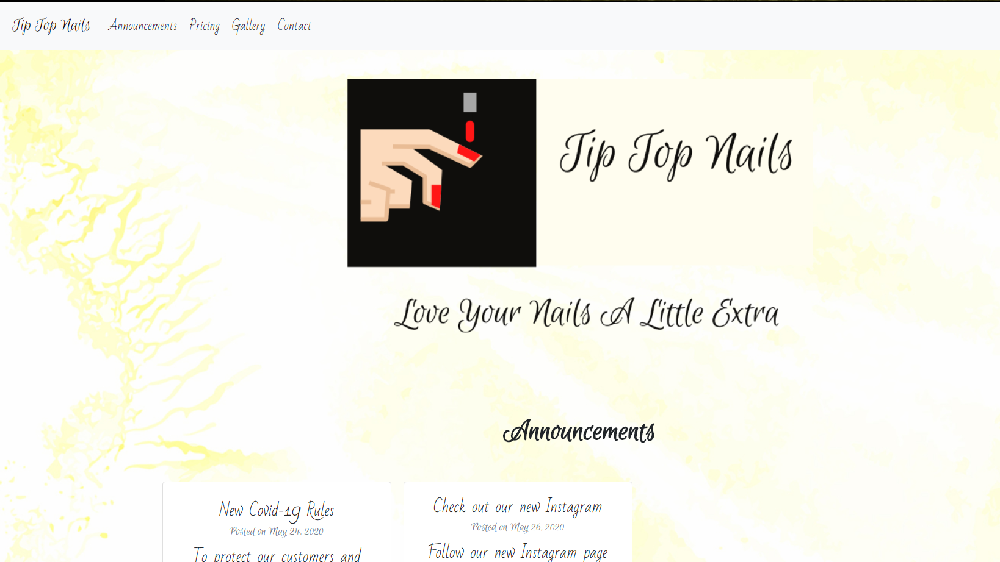

# Tip Top Nails
This is a website made for a local nails salon that displays basic information about the business for customers.

## Live Site
[Check Out Tip Top Nails Website](https://www.tiptopnailsvero.com)
 

## Built With

- [Bootstrap](https://www.getbootstrap.com): Framework Used in Project
- [React](https://reactjs.org/): Library used for the front end interface
- [MongoDB](https://www.mongodb.com/): Database used to store data in backend
- [Express](https://expressjs.com/): Framework used for server
- [Node](https://nodejs.org/en/)

## Authors

Rogelio Orosco Martinez - [Rmartinez2020](https://github.com/rmartinez2020)

## Future Update

- Add sign in for owner to be able to update the announcements and prices/products
- add carousel for the gallery
- UI polishing  